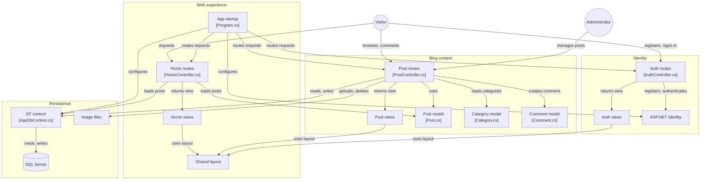

# 📝 HappyBlog — ASP.NET Core MVC Blog Application

HappyBlog is a full-stack blogging web application built with **ASP.NET Core MVC**, **Entity Framework Core (Code First)**, and **MS SQL Server**. It lets visitors browse and comment on posts, and lets administrators create, edit, and manage blog posts, categories, and images — all secured with ASP.NET Identity.

This project was built as part of a **Full Stack Developer Internship at Qralink Technologies Pvt. Ltd.**

---

## ✨ Features

- 🔐 **User Authentication** — Register, log in, and log out using ASP.NET Identity
- 📰 **Blog Post Management** — Full CRUD operations for posts (create, read, update, delete)
- 🗂️ **Categories** — Organize posts under categories (Technology, Health, Lifestyle, Education, Sports, etc.)
- 💬 **Comments** — Visitors can comment on blog posts
- 🖼️ **Image Uploads** — Upload and manage featured images for posts
- 📱 **Responsive UI** — Built with Bootstrap for cross-device compatibility
- 🏗️ **Clean MVC Architecture** — Clear separation of Controllers, Models, and Views

---

## 🏛️ Architecture



---

## 🧰 Tech Stack

| Layer          | Technology                          |
|----------------|--------------------------------------|
| Framework      | ASP.NET Core MVC (.NET)              |
| ORM            | Entity Framework Core (Code First)   |
| Database       | Microsoft SQL Server                 |
| Authentication | ASP.NET Core Identity                |
| Frontend       | Razor Views, Bootstrap, CSS, JS      |
| Language       | C#                                   |

---

## 📁 Project Structure

```
HappyBlog/
├── Controllers/
│   ├── HomeController.cs
│   ├── PostController.cs
│   └── AuthController.cs
├── Models/
│   ├── Post.cs
│   ├── Category.cs
│   └── Comment.cs
├── Data/
│   └── AppDbContext.cs
├── Views/
│   ├── Home/
│   ├── Post/
│   ├── Auth/
│   └── Shared/
├── wwwroot/
│   └── images/
└── Program.cs
```

---

## 🚀 Getting Started

### Prerequisites

- [.NET SDK](https://dotnet.microsoft.com/download) (6.0 or later)
- [SQL Server](https://www.microsoft.com/sql-server) (Express or full edition)
- Visual Studio 2022 / Visual Studio Code

### Installation

1. **Clone the repository**
   ```bash
   git clone https://github.com/subhranshusahu05/happyblog_mvc_project.git
   cd happyblog_mvc_project/HappyBlog
   ```

2. **Configure the database connection**

   Update the connection string in `appsettings.json`:
   ```json
   "ConnectionStrings": {
     "DefaultConnection": "Server=YOUR_SERVER;Database=HappyBlogDb;Trusted_Connection=True;TrustServerCertificate=True;"
   }
   ```

3. **Apply migrations**
   ```bash
   dotnet ef database update
   ```

4. **Run the application**
   ```bash
   dotnet run
   ```

5. Open your browser and navigate to `https://localhost:5001` (or the port shown in the console).

---

## 👤 User Roles

| Role          | Capabilities                                              |
|---------------|-------------------------------------------------------------|
| Visitor       | Browse posts, view categories, add comments                |
| Administrator | Create, edit, delete posts; manage categories and images    |

---

## 🖼️ Video  https://youtu.be/sqYiL-EYN6E


---

## 🙏 Acknowledgment

This project was developed during a **Full Stack Developer Internship** at **Qralink Technologies Pvt. Ltd.**, where I gained hands-on experience with C#, ASP.NET Core MVC, ASP.NET Core Web API, Bootstrap, and MS SQL Server.

---

## 📄 License

This project is open source and available for learning purposes. Feel free to fork and build upon it.

---

## 📬 Contact

**Subhranshu Sekhar Sahu**
Electronics and Telecommunication Engineering, Parala Maharaja Engineering College (PMEC)

